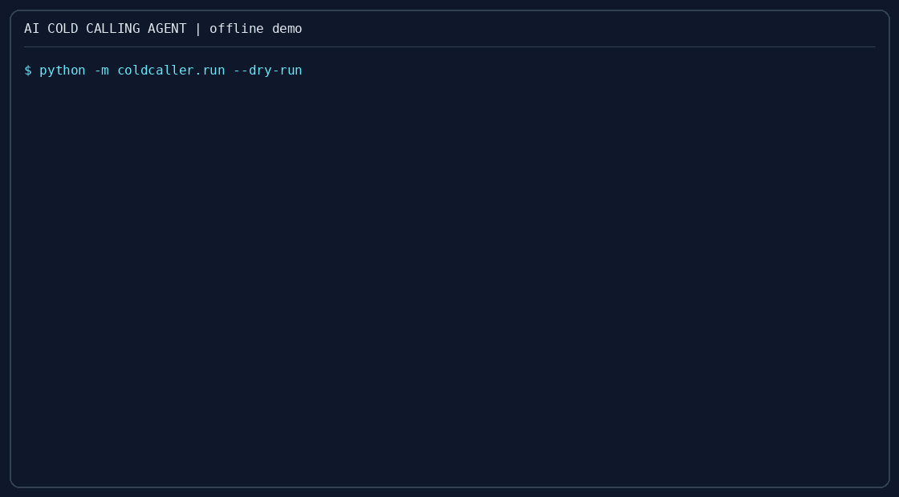
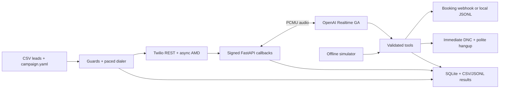
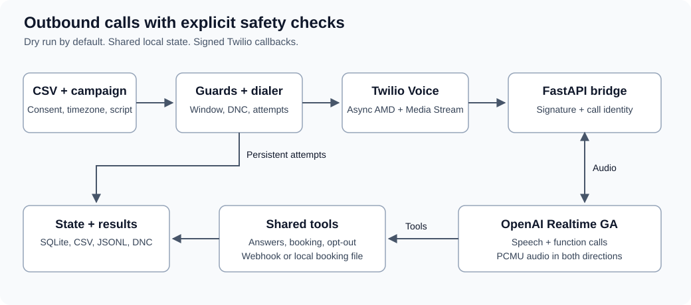

# AI cold calling agent: open source outbound calling starter (Twilio + OpenAI Realtime)

**An AI cold calling agent reads a consent-tagged lead list, checks local calling guards, and uses speech-to-speech AI to qualify a prospect and record a meeting request.**

[](https://github.com/jbrazy480/ai-cold-calling-agent/actions/workflows/ci.yml)
[](LICENSE)
[](https://www.python.org/)
[](https://aiguyofficial.com/resources?utm_source=github&utm_medium=readme&utm_campaign=ai-cold-calling-agent)



## What it does

- Reads CSV leads and a YAML campaign. Dry run is the default; only `--live` places calls.
- Checks consent, lead DNC flag, local `dnc.txt`, E.164 syntax, recipient calling window, and persistent attempt limits.
- Paces Twilio calls, waits for async answering machine detection, and speaks an AI disclosure before connecting a human to the agent.
- Bridges Twilio mu-law 8 kHz audio directly to OpenAI Realtime GA, including interruptions and function tools.
- Records answers, sends meeting requests to a webhook or local file, accepts lack of interest, and immediately persists DNC requests.
- Exports results as CSV and JSONL. Includes an offline simulator, doctor, Dockerfile, tests, and CI.

## Who this is for

Developers and agencies prototyping permission-based outbound voice workflows. This is a small, single-host starter you operate yourself. It has no campaign dashboard, calendar availability service, or national DNC registry integration.

## Quickstart

### 60-second offline demo, no keys

Use Python 3.11 or newer on Linux, macOS, or WSL. From this directory:

```bash
python3 -m venv .venv
source .venv/bin/activate
pip install -r requirements-dev.txt
python -m coldcaller.check
python -m coldcaller.run --dry-run
python -m coldcaller.simulate
```

The planner uses `leads.example.csv` and `campaign.example.yaml` when paths are omitted. All example phone numbers use fake 555 numbers. It prints CALL or SKIP with a reason and writes plan rows to `data/results.csv` and `data/results.jsonl`. Window decisions use the current clock, so output varies by time of day. Dry runs never consume attempts.

The simulator uses deterministic prospect replies and the same tool handlers as live calls. It exercises qualification, a busy objection, a meeting request, a DNC request, and lack of interest. It uses a temporary directory, makes no network calls, ignores live webhook configuration, and does not change your real DNC file. To inspect its artifacts:

```bash
python -m coldcaller.simulate --output-dir data/simulation
python scripts/make_demo_gif.py
```

### Real phone calls

Prepare a Twilio account and voice-capable number, an OpenAI API key with Realtime access, and an HTTPS tunnel. Install [ngrok](https://ngrok.com/docs/getting-started/) and authenticate it. Then:

```bash
cp .env.example .env
cp campaign.example.yaml campaign.yaml
cp leads.example.csv leads.csv
touch dnc.txt
ngrok http 8000
```

Edit `.env`: set your credentials, Twilio caller number, and `PUBLIC_BASE_URL` to the tunnel's HTTPS origin, without a trailing slash or path. Keep signature validation enabled. Edit `campaign.yaml` and `leads.csv` using actual, permissioned test recipients; the fake example numbers cannot receive calls. The consent column records your decision, it does not establish lawful consent.

In a separate terminal with the virtual environment active:

```bash
python -m coldcaller.check --live --campaign campaign.yaml --leads leads.csv
uvicorn coldcaller.server:app --host 0.0.0.0 --port 8000 --workers 1
```

In another terminal, from the same directory and environment:

```bash
source .venv/bin/activate
python -m coldcaller.run --leads leads.csv --campaign campaign.yaml --dry-run
python -m coldcaller.run --leads leads.csv --campaign campaign.yaml --live
```

The dialer supplies outbound TwiML, AMD, and status callback URLs through Twilio REST. There is no inbound number webhook to configure for this flow. Keep the tunnel, server, and dialer running until the calls finish. Calls first wait silently for async AMD; human detection releases the AI disclosure and stream. A machine result plays the configured voicemail or hangs up. Unknown/fax detection hangs up. The provider call time limit also bounds calls when callbacks fail. See [Twilio AMD](https://www.twilio.com/docs/voice/answering-machine-detection).

Do not run another dialer against a different data directory for the same campaign. One local file lock protects the shared scheduler. After an interrupted run, active calls are checked before new calls start. A creation timeout without a known Call SID blocks further dialing: inspect Twilio's call logs and reconcile the row in SQLite before resuming. Never erase attempt history just to retry.

### Docker

```bash
docker build -t ai-cold-calling-agent .
docker run --rm --name coldcaller --env-file .env -p 8000:8000 \
  -v "$PWD/data:/app/data" -v "$PWD/dnc.txt:/app/dnc.txt" \
  ai-cold-calling-agent
```

Prepare the host data directory and DNC file with write permission for the container's `caller` user. The live dialer can run on the host with the same data and DNC paths. Campaign configuration is persisted with each call, so the server uses the exact dialer configuration. A mounted `.env` file is unnecessary; Docker receives the environment via `--env-file`.

## Configuration

Copy [campaign.example.yaml](campaign.example.yaml) and [leads.example.csv](leads.example.csv). Unknown campaign keys and malformed CSV rows fail with an error rather than silently changing behavior.

| Environment variable | Purpose |
| --- | --- |
| `OPENAI_API_KEY` | Realtime API credential, required for live calls |
| `TWILIO_ACCOUNT_SID` | Twilio account that owns the outbound calls |
| `TWILIO_AUTH_TOKEN` | REST credential and webhook signature validation secret |
| `TWILIO_PHONE_NUMBER` | Voice-capable outbound caller ID in E.164 form |
| `PUBLIC_BASE_URL` | External HTTPS origin used for callbacks and exact signature reconstruction |
| `DATA_DIR` | Shared state and exports directory, default `data` |
| `DNC_PATH` | Local suppression file, default `dnc.txt` |
| `VALIDATE_TWILIO_SIGNATURES` | Default `true`; `false` is only for isolated local development |

The doctor validates files, timezone data, directory access, and required environment values without contacting providers. It cannot prove that credentials, number permissions, a tunnel, or API access work. `--live` makes missing live configuration a failing check.

| Campaign key | Behavior |
| --- | --- |
| `agent_name`, `company`, `offer` | Agent identity and purpose |
| `qualification_questions` | Ordered questions; answers are saved by question |
| `objection_notes` | Instructions for handling objections without pressure |
| `voice` | Realtime output voice, default `marin` |
| `calling_window.start`, `.end` | Local window, default `09:00` inclusive to `20:00` exclusive; narrower windows are supported |
| `require_consent` | Default `true`; requires CSV `consent=yes` |
| `max_attempts_per_lead` | Default `2`, counted by phone across live runs in the shared database |
| `seconds_between_calls` | Minimum gap between call creations, default `5` |
| `max_concurrent_calls` | Default `1`; a slot stays occupied until terminal call status |
| `booking_webhook_url` | Optional POST endpoint; otherwise writes `data/bookings.jsonl` |
| `ai_disclosure`, `ai_disclosure_line` | Disclosure enabled by default; nonempty opening line required when enabled |
| `voicemail_enabled`, `voicemail_message` | Default is hangup; optional short TwiML Say message after machine greeting |
| `max_call_seconds` | Provider and bridge duration bound, default `300` |

CSV columns are `name,phone,company,timezone,consent,dnc,notes`. Name, phone, consent, and DNC columns are required. Company, timezone, and notes may be omitted. Consent and DNC must be yes/no. Quote fields containing commas. Duplicate phones, columns, missing values, and malformed quoting are errors. Invalid phone syntax is a visible planner skip.

Use IANA timezones such as `America/New_York`. Without one, the bundled map supplies US/Canada NPA candidates. The window must be open in **every** candidate timezone. Unknown NPAs, international numbers without an explicit timezone, and invalid timezone names skip. Overnight windows are rejected. DST uses Python `zoneinfo`. A phone's area code cannot establish its owner's current location; explicitly record the recipient timezone when known.

Put one E.164 number per line in `dnc.txt`; blank lines and `#` comments are accepted. DNC flags and internal DNC entries always skip, even when consent checking is disabled. The implementation does **not** check the national DNC registry.

The bundled map contains 415 entries as measured by `coldcaller.check`. It is a conservative union of prefix timezone candidates, which can contain extra zones. Read [data provenance and regeneration](docs/data-provenance.md). Newly allocated or missing NPAs require an explicit timezone until the data is refreshed.

## Architecture





| Endpoint | Purpose |
| --- | --- |
| `GET /health` | Process health, no credentials or lead data exposed |
| `POST /twiml/outbound` | Wait for AMD, then disclosure and Connect/Stream for a human |
| `POST /amd` | Persist AMD classification; optionally redirect to voicemail |
| `POST /status` | Persist call status; ignore older callback sequences |
| `WS /media-stream` | Validate handshake signature and call identity; bridge audio |

The stream uses `wss://api.openai.com/v1/realtime?model=gpt-realtime`, a `session.update` of type `realtime`, and `audio/pcmu` input/output. Audio arrives as `response.output_audio.delta`. Twilio playback marks and media timestamps bound `conversation.item.truncate` on barge-in. Tools use `response.function_call_arguments.done` and `function_call_output` conversation items. No transcoding is needed. See [Twilio Media Stream messages](https://www.twilio.com/docs/voice/media-streams/websocket-messages).

SQLite is the source of truth; CSV and JSONL are refreshed snapshots containing one row per planning or live attempt, not an append-only callback log. They include status, outcome, answers, booked time, and skip reason. Plan rows do not count as attempts. A live reservation counts even on a failed or uncertain call creation. Callback URLs carry an opaque reservation ID to handle callbacks arriving before REST returns the Call SID.

Run a single server worker and a single dialer on the same local filesystem. Tool IDs are cached to avoid repeated effects within a call. The booking webhook receives an `Idempotency-Key` header equal to the call ID and must honor it: network failures cannot guarantee exactly-once remote delivery. SQLite and export files are serialized locally, but this is not a distributed job queue. Retain and protect runtime records according to your needs; they contain personal information.

## How does the AI cold calling agent book a meeting?

The agent asks for an agreed time and timezone, then invokes `book_meeting(time, email?)` with an ISO 8601 time including an offset. A webhook receives JSON with `id`, `phone`, `name`, `time`, and `email`. HTTP success records `booking_requested`; failure is returned to the agent without claiming success. Without a webhook, the same payload is saved locally. Connect your own scheduling system to check availability and send confirmations. The starter itself records meeting requests and does not reserve a calendar slot.

## How does the agent stop calling someone?

`request_dnc(reason)` persists the phone number immediately, records the outcome, and redirects the call to a polite TwiML Say and Hangup. `mark_not_interested(reason)` ends the current call without adding a permanent suppression. Future runs recheck the DNC file immediately before creating each call. The simulator uses its own isolated suppression file.

## How much does it cost to run?

The offline demo makes no provider requests. Live usage incurs provider and hosting charges. Consult [Twilio Voice pricing](https://www.twilio.com/en-us/voice/pricing) and [OpenAI API pricing](https://openai.com/api/pricing/) for your account, destination, model, and enabled options. This repository does not estimate rates or promise call economics.

## Testing

```bash
pip install -r requirements-dev.txt
pytest -q
python -m coldcaller.run --dry-run
python -m coldcaller.simulate
python scripts/make_demo_gif.py
```

Tests block outbound sockets and use fake provider clients/websockets. They cover every guard, area-code inference, split zones, DST and window boundaries, CSV errors, dry-run output, TwiML, signature tampering, AMD, callback ordering, audio forwarding, interruption, tool round trips, immediate DNC persistence, webhook failures, and the simulator. CI runs the suite and offline commands on supported Python versions. Provider mocks verify behavior without proving live account connectivity; a permissioned test call remains necessary before real use.

## Compliance note (not legal advice)

Calling real people with AI voices is regulated. The FCC has ruled that AI-generated voices fall within the TCPA's artificial or prerecorded voice provisions. Consent and other requirements depend on the call and jurisdiction. Read the [FCC ruling](https://docs.fcc.gov/public/attachments/FCC-24-17A1_Rcd.pdf) and get appropriate legal advice for your workflow.

The consent flag, disclosure, DNC file, attempts, and time windows are helpers, not a compliance guarantee. This starter does **not** check the national DNC registry, establish lawful consent, identify every applicable calling restriction, or account for every local rule. Do not disable safeguards merely to make a skipped lead eligible. Review scripts, data retention, consent records, and opt-out handling before making calls.

## How does this compare with other approaches?

| Area | This starter | Build from scratch | Hosted platform |
| --- | --- | --- | --- |
| Starting point | Working CLI, bridge, tools, tests | You design and implement the flow | Configure the offered workflow |
| Operations | You host and monitor | You host and monitor | Provider operates the platform |
| Customization | Edit Python and YAML | Full implementation control | Depends on exposed settings and APIs |
| Data and integrations | Local exports and booking webhook | Build your own storage and connectors | Depends on provider |
| Guard responsibility | You validate suitability and extend helpers | You implement checks | Review provider controls and your obligations |

## FAQ

### Can I try it without Twilio or OpenAI credentials?

Yes. The dry-run planner, simulator, doctor, and test suite run offline. The simulator is rule-based and is not a model-quality evaluation.

### Why was a lead skipped?

The plan prints the first failed guard. Fix the underlying data or wait for the configured local window. If the area code spans zones, all candidate local windows must be open. Skipped rows do not consume attempts.

### Does it call the same lead repeatedly in one run?

No. Duplicate phones in a CSV are rejected, and each eligible row gets one attempt per invocation. Later invocations may retry within the persistent attempt limit. There is no automatic redial loop for busy or unanswered calls.

### Why do signed callbacks fail behind my tunnel?

Set `PUBLIC_BASE_URL` to the exact HTTPS origin Twilio calls and restart the server after changing it. The server reconstructs URLs from this trusted setting instead of proxy host headers. Signed WebSocket upgrades use the HTTPS handshake URL. See [Twilio request validation](https://www.twilio.com/docs/usage/security).

### Can I scale this across hosts?

The included state and scheduler assume a single host. Multi-host operation needs a shared transactional queue, stronger tool deduplication, operational monitoring, and a storage design appropriate to your deployment. Do not share SQLite through a network filesystem.

## Going further

Get free resources, templates and community at [AI Guy resources](https://aiguyofficial.com/resources?utm_source=github&utm_medium=readme&utm_campaign=ai-cold-calling-agent).

When you need this across many client numbers with a dialer and CRM built in, RizzDial is a commercial platform for that: [RizzDial AI dialer](https://rizzdial.com/ai-dialer?utm_source=github&utm_medium=readme&utm_campaign=ai-cold-calling-agent).

## License

[MIT](LICENSE), for this starter only. Bundled timezone data has its own [Apache 2.0 attribution](docs/data-provenance.md). RizzDial is a separate commercial platform.

Maintained by James Hill (The AI Guy).
