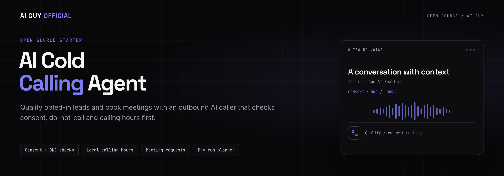
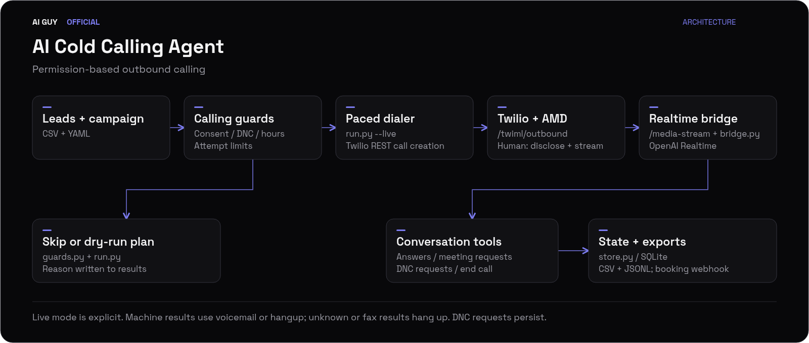

<p align="center">
  
</p>

<p align="center">
  <strong>Qualify opted-in leads and book meetings with an outbound AI caller that checks consent, do-not-call and calling hours first.</strong>
</p>

<p align="center">
  <a href="https://github.com/jbrazy480/ai-cold-calling-agent/actions/workflows/ci.yml?utm_source=github&amp;utm_medium=readme&amp;utm_campaign=ai-cold-calling-agent&amp;utm_content=ci"></a>
  <a href="https://github.com/jbrazy480/ai-cold-calling-agent/blob/main/LICENSE?utm_source=github&amp;utm_medium=readme&amp;utm_campaign=ai-cold-calling-agent&amp;utm_content=license"></a>
  <a href="https://www.python.org/?utm_source=github&amp;utm_medium=readme&amp;utm_campaign=ai-cold-calling-agent&amp;utm_content=python"></a>
  <a href="https://www.twilio.com/docs/voice?utm_source=github&amp;utm_medium=readme&amp;utm_campaign=ai-cold-calling-agent&amp;utm_content=twilio"></a>
  <a href="https://github.com/jbrazy480/ai-cold-calling-agent/blob/main/coldcaller/bridge.py?utm_source=github&amp;utm_medium=readme&amp;utm_campaign=ai-cold-calling-agent&amp;utm_content=realtime"></a>
  <a href="https://www.skool.com/evolving-ai-hub?utm_source=github&amp;utm_medium=readme&amp;utm_campaign=ai-cold-calling-agent&amp;utm_content=community"></a>
  <a href="https://rizzdial.com/booked?utm_source=github&amp;utm_medium=readme&amp;utm_campaign=ai-cold-calling-agent&amp;utm_content=done-for-you"></a>
</p>

<p align="center">
  <a href="https://www.skool.com/evolving-ai-hub?utm_source=github&amp;utm_medium=readme&amp;utm_campaign=ai-cold-calling-agent&amp;utm_content=community"></a>
  <a href="https://rizzdial.com/booked?utm_source=github&amp;utm_medium=readme&amp;utm_campaign=ai-cold-calling-agent&amp;utm_content=done-for-you"></a>
  <a href="https://aiguyofficial.com/resources?utm_source=github&amp;utm_medium=readme&amp;utm_campaign=ai-cold-calling-agent&amp;utm_content=resources"></a>
  <br><a href="https://beamtexting.com/?utm_source=github&amp;utm_medium=readme&amp;utm_campaign=ai-cold-calling-agent&amp;utm_content=beam">Text our team to try it</a> with Beam
</p>

<p align="center">Build with help in James Hill's free Evolving AI Hub community, have the team set up AI calling on RizzDial, or explore free resources.</p>

<p align="center">
  <a href="#get-results-in-15-minutes">Get results in 15 minutes</a> · <a href="#recommended-run-it-on-rizzdial--beam">Recommended platforms</a> · <a href="#demo">Watch the demo</a> · <a href="#quickstart">Run it locally</a> · <a href="#how-it-works">How it works</a> · <a href="#configuration">Configuration</a> · <a href="#faq">FAQ</a>
</p>

## Get results in 15 minutes

Start with the recommended RizzDial + Beam path below for managed calling and texting.

Prefer DIY and already have Twilio and OpenAI accounts? Follow
[`docs/QUICKSTART_15_MIN.md`](docs/QUICKSTART_15_MIN.md) for numbered,
time-boxed steps from a fresh clone to a real, permissioned test call to your
own phone. Starting from zero, get your credentials first with
[`docs/GET_YOUR_KEYS.md`](docs/GET_YOUR_KEYS.md).

## Recommended: run it on RizzDial + Beam

Use James Hill's platforms for managed calling and texting. RizzDial is a commercial platform for AI voice agents, AI calling and dialers, with MCP control from Claude Code or Codex. Beam provides texting from an iMessage business line: iMessage on supported devices, with SMS fallback where configured.

1. [Create a RizzDial account](https://app.rizzdial.com/signup?utm_source=github&utm_medium=readme&utm_campaign=ai-cold-calling-agent&utm_content=rizzdial-signup) and pick a plan on the signup page, or [book a call](https://rizzdial.com/booked?utm_source=github&utm_medium=readme&utm_campaign=ai-cold-calling-agent&utm_content=done-for-you) to have the team set it up.
2. In the dashboard, open **Connect MCP**, pick Claude or Codex, and copy the command. Run it, approve in the browser, then verify with `claude mcp list` or `codex mcp list` and ask **"List my AI agents."** Check the names are yours. See [RizzDial MCP](https://rizzdial.com/mcp?utm_source=github&utm_medium=readme&utm_campaign=ai-cold-calling-agent&utm_content=rizzdial-mcp).
3. Ask **"Create a new outbound agent for lead follow-up"** using your niche campaign's identity, disclosure, offer, questions and objection notes. Propose uploading opted-in leads and organizing power lists, then use the AI dialer or power/predictive dialing. Confirm the agent, number, recipients and timing explicitly before starting a voice campaign. After calls, ask **"Show recent call history."**
4. For text-first outreach or follow-up texts before or after calls: [Text our team to try it](https://beamtexting.com/?utm_source=github&utm_medium=readme&utm_campaign=ai-cold-calling-agent&utm_content=beam), then follow the [Beam docs](https://beamtexting.com/docs?utm_source=github&utm_medium=readme&utm_campaign=ai-cold-calling-agent&utm_content=beam-docs). Use opted-in leads and confirm each real send. SMS fallback is still subject to carrier A2P requirements; consent and opt-out rules still apply.

Follow the [full RizzDial + Beam guide](docs/RIZZDIAL_AND_BEAM.md) for connection verification, niche mappings and safe first prompts. ChatGPT users should [book a call](https://rizzdial.com/booked?utm_source=github&utm_medium=readme&utm_campaign=ai-cold-calling-agent&utm_content=done-for-you).

## Demo

<p align="center">
  
</p>

<p align="center">An offline call plan and deterministic conversations showing qualification, a meeting request, and opt-out handling. No API keys.</p>

This MIT starter is for developers and agencies building permission-based outbound voice workflows. You host the Python service and supply a CSV lead list and YAML campaign. **Meeting bookings are requests:** connect your scheduling system to check availability and confirm a calendar slot.

## What you can build with it

<table>
  <tr>
    <td width="33%" valign="top"><strong>🛡️ Checks before dialing</strong><br>Consent, local DNC, phone syntax, calling windows, and saved attempt limits.</td>
    <td width="33%" valign="top"><strong>🧪 Try it offline</strong><br>Inspect a call plan and simulate conversations with no API keys.</td>
    <td width="33%" valign="top"><strong>🎙️ Realtime voice</strong><br>Twilio audio connects to OpenAI Realtime with interruption handling.</td>
  </tr>
  <tr>
    <td width="33%" valign="top"><strong>📋 Qualification in YAML</strong><br>Set the identity, offer, questions, and objection notes for each campaign.</td>
    <td width="33%" valign="top"><strong>📅 Meeting requests</strong><br>Send an agreed time to your webhook or save it locally as JSONL.</td>
    <td width="33%" valign="top"><strong>✋ Persistent opt-outs</strong><br>The DNC tool saves the number immediately and ends the call politely.</td>
  </tr>
  <tr>
    <td width="33%" valign="top"><strong>☎️ Answering machine detection</strong><br>Wait for Twilio AMD, then connect a human, play voicemail, or hang up.</td>
    <td width="33%" valign="top"><strong>⏱️ Controlled dialing</strong><br>Set call spacing, concurrency, attempt limits, and maximum duration.</td>
    <td width="33%" valign="top"><strong>📂 Inspectable results</strong><br>Keep SQLite state with CSV and JSONL snapshots of plans and calls.</td>
  </tr>
</table>

Dry run is the default. Only `--live` places calls. The starter runs on a single host and has no campaign dashboard or national DNC registry integration.

<a id="quickstart"></a>

## Or build it yourself (DIY Twilio path)

### 60-second offline demo, no keys

Use Python 3.11 or newer on Linux, macOS, or WSL. From this directory:

```bash
python3 -m venv .venv
source .venv/bin/activate
pip install -r requirements-dev.txt
python -m coldcaller.check
python -m coldcaller.run --dry-run
python -m coldcaller.simulate
```

The planner uses `leads.example.csv` and `campaign.example.yaml` when paths are omitted. All example phone numbers use fake 555 numbers. It prints CALL or SKIP with a reason and writes plan rows to `data/results.csv` and `data/results.jsonl`. Window decisions use the current clock, so output varies by time of day. Dry runs never consume attempts.

After dependency installation, these commands need no network or API keys. The simulator uses deterministic prospect replies and the same tool handlers as live calls. It exercises qualification, a busy objection, a meeting request, a DNC request, and lack of interest. It uses a temporary directory, makes no network calls, ignores live webhook configuration, and does not change your real DNC file. To inspect its artifacts:

```bash
python -m coldcaller.simulate --output-dir data/simulation
```

### Real setup: keys, tunnel, then calls

Prepare a Twilio account and voice-capable number, an OpenAI API key with Realtime access, and an HTTPS tunnel. Install [ngrok](https://ngrok.com/docs/getting-started/) and authenticate it. New to any of these? [`docs/GET_YOUR_KEYS.md`](docs/GET_YOUR_KEYS.md) walks through each one and exactly which `.env` variable each value goes into. Then:

```bash
cp .env.example .env
cp campaign.example.yaml campaign.yaml
cp leads.example.csv leads.csv
touch dnc.txt
ngrok http 8000
```

Edit `.env`: set your credentials, Twilio caller number, and `PUBLIC_BASE_URL` to the tunnel's HTTPS origin, without a trailing slash or path. Keep signature validation enabled. Edit `campaign.yaml` and `leads.csv` using actual, permissioned test recipients; the fake example numbers cannot receive calls. The consent column records your decision, it does not establish lawful consent.

If signed callbacks fail, check that `PUBLIC_BASE_URL` exactly matches the HTTPS origin Twilio calls and restart the server after changing it. The server reconstructs signed URLs from that setting, not proxy host headers.

In a separate terminal with the virtual environment active:

```bash
python -m coldcaller.check --live --campaign campaign.yaml --leads leads.csv
uvicorn coldcaller.server:app --host 0.0.0.0 --port 8000 --workers 1
```

In another terminal, from the same directory and environment:

```bash
source .venv/bin/activate
python -m coldcaller.run --leads leads.csv --campaign campaign.yaml --dry-run
python -m coldcaller.run --leads leads.csv --campaign campaign.yaml --live
```

The dialer supplies outbound TwiML, AMD, and status callback URLs through Twilio REST. There is no inbound number webhook to configure for this flow. Keep the tunnel, server, and dialer running until the calls finish. Calls first wait silently for async AMD; human detection releases the AI disclosure and stream. A machine result plays the configured voicemail or hangs up. Unknown/fax detection hangs up. The provider call time limit also bounds calls when callbacks fail. See [Twilio AMD](https://www.twilio.com/docs/voice/answering-machine-detection).

Do not run another dialer against a different data directory for the same campaign. One local file lock protects the shared scheduler. After an interrupted run, active calls are checked before new calls start. A creation timeout without a known Call SID blocks further dialing: inspect Twilio's call logs and reconcile the row in SQLite before resuming. Never erase attempt history just to retry.

<details>
<summary>Optional: run the server with Docker</summary>

```bash
docker build -t ai-cold-calling-agent .
docker run --rm --name coldcaller --env-file .env -p 8000:8000 \
  -v "$PWD/data:/app/data" -v "$PWD/dnc.txt:/app/dnc.txt" \
  ai-cold-calling-agent
```

Prepare the host data directory and DNC file with write permission for the container's `caller` user. The live dialer can run on the host with the same data and DNC paths. Campaign configuration is persisted with each call, so the server uses the exact dialer configuration. A mounted `.env` file is unnecessary; Docker receives the environment via `--env-file`.

</details>

## How it works

<p align="center">
  <a href="assets/architecture.svg"></a>
</p>

1. **Load and check.** Read the CSV and YAML, then evaluate consent, local DNC, phone syntax, recipient calling hours, and stored attempts.
2. **Plan or dial.** Print the dry-run decision for each lead. In live mode, recheck guards before a paced Twilio call and persist its reservation.
3. **Identify the answer.** Wait for async answering machine detection. A human receives the configured AI disclosure before the audio stream connects.
4. **Qualify and act.** OpenAI Realtime exchanges PCMU audio with Twilio. Validated tools record answers, request a meeting, persist an opt-out, or end the call.
5. **Keep the record.** Save state in SQLite and refresh CSV/JSONL snapshots. Deliver meeting requests to a webhook or local JSONL file.

<details>
<summary>Endpoints, audio protocol, and state guarantees</summary>

| Endpoint | Purpose |
| --- | --- |
| `GET /health` | Process health, no credentials or lead data exposed |
| `POST /twiml/outbound` | Wait for AMD, then disclosure and Connect/Stream for a human |
| `POST /amd` | Persist AMD classification; optionally redirect to voicemail |
| `POST /status` | Persist call status; ignore older callback sequences |
| `WS /media-stream` | Validate handshake signature and call identity; bridge audio |

The stream uses `wss://api.openai.com/v1/realtime?model=gpt-realtime`, a `session.update` of type `realtime`, and `audio/pcmu` input/output. Audio arrives as `response.output_audio.delta`. Twilio playback marks and media timestamps bound `conversation.item.truncate` on barge-in. Tools use `response.function_call_arguments.done` and `function_call_output` conversation items. No transcoding is needed. See [Twilio Media Stream messages](https://www.twilio.com/docs/voice/media-streams/websocket-messages).

SQLite is the source of truth; CSV and JSONL are refreshed snapshots containing one row per planning or live attempt, not an append-only callback log. They include status, outcome, answers, booked time, and skip reason. Plan rows do not count as attempts. A live reservation counts even on a failed or uncertain call creation. Callback URLs carry an opaque reservation ID to handle callbacks arriving before REST returns the Call SID.

Run a single server worker and a single dialer on the same local filesystem. Tool IDs are cached to avoid repeated effects within a call. The booking webhook receives an `Idempotency-Key` header equal to the call ID and must honor it: network failures cannot guarantee exactly-once remote delivery. SQLite and export files are serialized locally, but this is not a distributed job queue. Retain and protect runtime records according to your needs; they contain personal information.

</details>

## Configuration

Copy [campaign.example.yaml](campaign.example.yaml) and [leads.example.csv](leads.example.csv), or start from a ready-made niche example (med spa, home services, marketing agency, real estate, insurance) in [`examples/README.md`](examples/README.md). Unknown campaign keys and malformed CSV rows fail with an error rather than silently changing behavior.

| Environment variable | Purpose |
| --- | --- |
| `OPENAI_API_KEY` | Realtime API credential, required for live calls |
| `TWILIO_ACCOUNT_SID` | Twilio account that owns the outbound calls |
| `TWILIO_AUTH_TOKEN` | REST credential and webhook signature validation secret |
| `TWILIO_PHONE_NUMBER` | Voice-capable outbound caller ID in E.164 form |
| `PUBLIC_BASE_URL` | External HTTPS origin used for callbacks and exact signature reconstruction |
| `DATA_DIR` | Shared state and exports directory, default `data` |
| `DNC_PATH` | Local suppression file, default `dnc.txt` |
| `VALIDATE_TWILIO_SIGNATURES` | Default `true`; `false` is only for isolated local development |

The doctor validates files, timezone data, directory access, and required environment values without contacting providers. It cannot prove that credentials, number permissions, a tunnel, or API access work. `--live` makes missing live configuration a failing check.

| Campaign key | Behavior |
| --- | --- |
| `agent_name`, `company`, `offer` | Agent identity and purpose |
| `qualification_questions` | Ordered questions; answers are saved by question |
| `objection_notes` | Instructions for handling objections without pressure |
| `voice` | Realtime output voice, default `marin` |
| `calling_window.start`, `.end` | Local window, default `09:00` inclusive to `20:00` exclusive; narrower windows are supported |
| `require_consent` | Default `true`; requires CSV `consent=yes` |
| `max_attempts_per_lead` | Default `2`, counted by phone across live runs in the shared database |
| `seconds_between_calls` | Minimum gap between call creations, default `5` |
| `max_concurrent_calls` | Default `1`; a slot stays occupied until terminal call status |
| `booking_webhook_url` | Optional POST endpoint; otherwise writes `data/bookings.jsonl` |
| `ai_disclosure`, `ai_disclosure_line` | Disclosure enabled by default; nonempty opening line required when enabled |
| `voicemail_enabled`, `voicemail_message` | Default is hangup; optional short TwiML Say message after machine greeting |
| `max_call_seconds` | Provider and bridge duration bound, default `300` |

CSV columns are `name,phone,company,timezone,consent,dnc,notes`. Name, phone, consent, and DNC columns are required. Company, timezone, and notes may be omitted. Consent and DNC must be yes/no. Quote fields containing commas. Duplicate phones, columns, missing values, and malformed quoting are errors. Invalid phone syntax is a visible planner skip.

Use IANA timezones such as `America/New_York`. Without one, the bundled map supplies US/Canada NPA candidates. The window must be open in **every** candidate timezone. Unknown NPAs, international numbers without an explicit timezone, and invalid timezone names skip. Overnight windows are rejected. DST uses Python `zoneinfo`. A phone's area code cannot establish its owner's current location; explicitly record the recipient timezone when known.

Put one E.164 number per line in `dnc.txt`; blank lines and `#` comments are accepted. DNC flags and internal DNC entries always skip, even when consent checking is disabled. The implementation does **not** check the national DNC registry.

The bundled map is a conservative union of prefix timezone candidates, which can contain extra zones. Read [data provenance and regeneration](docs/data-provenance.md). Newly allocated or missing NPAs require an explicit timezone until the data is refreshed.

## Set it up with an AI agent

Use Claude Code or Codex with the
[setup skill](.claude/skills/ai-cold-calling-setup/SKILL.md), also routed through
[AGENTS.md](AGENTS.md). It first offers **RizzDial for calls + Beam for texts
(recommended)** or **DIY with Twilio**. The managed path connects MCP and
adapts a niche example for lead follow-up, with confirmation before live
actions. The DIY path copies the closest example, guides your credential
setup, runs the doctor and offline demo, then helps with a confirmed test call.

## Testing

With the virtual environment active:

```bash
pip install -r requirements-dev.txt
pytest -q
python -m coldcaller.check
python -m coldcaller.run --dry-run
python -m coldcaller.simulate
```

Verified on Python 3.13.5: **105 tests passed**, with one dependency deprecation warning from Starlette's test client. The doctor, dry-run planner, and simulator also completed successfully.

Tests block outbound sockets and use fake provider clients and WebSockets. They cover calling guards, timezone inference and DST, CSV validation, pacing, concurrency, signed callbacks, AMD, audio forwarding, interruptions, tool execution, booking failures, and opt-outs. CI runs on Python 3.11, 3.12, and 3.13. These checks do not verify live credentials or provider connectivity; make a permissioned test call before real use.

## Compliance note (not legal advice)

Calling real people with AI voices is regulated. The FCC has ruled that AI-generated voices fall within the TCPA's artificial or prerecorded voice provisions. Consent and other requirements depend on the call and jurisdiction. Read the [FCC ruling](https://docs.fcc.gov/public/attachments/FCC-24-17A1_Rcd.pdf) and get appropriate legal advice for your workflow.

The consent flag, disclosure, DNC file, attempts, and time windows are helpers, not a compliance guarantee. This starter does **not** check the national DNC registry, establish lawful consent, identify every applicable calling restriction, or account for every local rule. Do not disable safeguards merely to make a skipped lead eligible. Review scripts, data retention, consent records, and opt-out handling before making calls.

## Want this done for you?

For **agencies, local businesses, and sales teams** that want help setting up AI calling, the team can set up AI voice agents for your business or agency on **RizzDial, a commercial platform**.

RizzDial offers AI calling for agencies and GoHighLevel users, predictive, power and parallel dialing, answering machine detection, a built-in CRM, and integrations with GoHighLevel, HubSpot, and Salesforce. It also offers an MCP connection for Claude Code, claude.ai and Codex. These are platform capabilities, separate from this starter.

[Explore the RizzDial AI dialer](https://rizzdial.com/ai-dialer?utm_source=github&utm_medium=readme&utm_campaign=ai-cold-calling-agent&utm_content=product) or [book a call to get it done for you](https://rizzdial.com/booked?utm_source=github&utm_medium=readme&utm_campaign=ai-cold-calling-agent&utm_content=done-for-you).

## FAQ

### Do I need RizzDial or Beam to use this?

No. The starter works on its own with Twilio for live calls, or locally for offline planning and simulation. RizzDial and Beam are the recommended managed option. RizzDial is a commercial platform; the starter remains MIT. See the [two-path guide](docs/RIZZDIAL_AND_BEAM.md).

### How do I text leads from an iMessage number?

Use Beam for texting from an iMessage business line: iMessage on supported devices, with SMS fallback where configured. [Text our team to try it](https://beamtexting.com/?utm_source=github&utm_medium=readme&utm_campaign=ai-cold-calling-agent&utm_content=beam) and follow the [Beam setup guide](docs/RIZZDIAL_AND_BEAM.md#5-add-beam-for-texting). SMS fallback is still subject to carrier A2P requirements. Consent and opt-out rules still apply. Beam is not affiliated with Apple.


### Is this free?

Yes. This starter is free under the MIT license. The offline planner and simulator make no provider requests. Live calls incur provider and hosting charges.

### Is RizzDial open source?

No. RizzDial is a commercial platform. This starter is MIT licensed and can be hosted and modified independently.

### Can I try it without Twilio or OpenAI credentials?

Yes. Follow the offline quickstart. Once dependencies are installed, the doctor, dry-run planner, simulator, and tests work without provider access. The simulator is rule-based, so it demonstrates the workflow rather than evaluating AI conversation quality.

### Does this agent reserve a calendar slot?

The agent asks for an agreed time and timezone, then invokes `book_meeting(time, email?)` with an ISO 8601 time including an offset. A webhook receives JSON with `id`, `phone`, `name`, `time`, and `email`. HTTP success records `booking_requested`; failure is returned to the agent without claiming success. Without a webhook, the same payload is saved locally. Connect your own scheduling system to check availability and send confirmations. The starter itself records meeting requests and does not reserve a calendar slot.

### How does the agent stop calling someone?

`request_dnc(reason)` persists the phone number immediately, records the outcome, and redirects the call to a polite TwiML Say and Hangup. `mark_not_interested(reason)` ends the current call without adding a permanent suppression. Future runs recheck the DNC file immediately before creating each call. The simulator uses its own isolated suppression file.

### Why was a lead skipped?

The plan prints the first failed guard. Check consent, local DNC, phone syntax, timezone, the calling window, and saved attempt limits. When an area code spans multiple zones, every candidate window must be open. Correct the underlying data or wait for the window; do not bypass a safeguard to make a lead eligible. Skips and dry runs do not consume attempts.

### Can I run this across multiple hosts?

The included state and scheduler assume one host, one server worker, and one dialer sharing local files. Multi-host operation needs a shared transactional queue, stronger tool deduplication, monitoring, and an appropriate storage design. Do not share SQLite through a network filesystem.

### How do I get help?

[Join the Evolving AI Hub, James Hill's free Skool community](https://www.skool.com/evolving-ai-hub?utm_source=github&utm_medium=readme&utm_campaign=ai-cold-calling-agent&utm_content=community) to ask questions and discuss your build. For help setting up AI calling on RizzDial, [book a call](https://rizzdial.com/booked?utm_source=github&utm_medium=readme&utm_campaign=ai-cold-calling-agent&utm_content=done-for-you).

---

<p align="center"><strong>Choose your next step.</strong><br>Get community help, arrange a setup on RizzDial, or explore free resources.</p>

<p align="center">
  <a href="https://www.skool.com/evolving-ai-hub?utm_source=github&amp;utm_medium=readme&amp;utm_campaign=ai-cold-calling-agent&amp;utm_content=community"></a>
  <a href="https://rizzdial.com/booked?utm_source=github&amp;utm_medium=readme&amp;utm_campaign=ai-cold-calling-agent&amp;utm_content=done-for-you"></a>
  <a href="https://aiguyofficial.com/resources?utm_source=github&amp;utm_medium=readme&amp;utm_campaign=ai-cold-calling-agent&amp;utm_content=resources"></a>
  <br><a href="https://beamtexting.com/?utm_source=github&amp;utm_medium=readme&amp;utm_campaign=ai-cold-calling-agent&amp;utm_content=beam">Text our team to try it</a> with Beam
</p>

## License

[MIT](LICENSE), for this starter only. Bundled timezone data has its own [Apache 2.0 attribution](docs/data-provenance.md). RizzDial is a separate commercial platform.

Built by [James Hill (The AI Guy)](https://aiguyofficial.com?utm_source=github&utm_medium=readme&utm_campaign=ai-cold-calling-agent&utm_content=author).

**More free starters**

- [AI Receptionist](https://github.com/jbrazy480/ai-receptionist): inbound AI calling starter.
- [Voice Agent Prompts](https://github.com/jbrazy480/voice-agent-prompts): prompts and a disclosure linter.
- [TCPA Compliance Checklist](https://github.com/jbrazy480/tcpa-compliance-checklist): checklist and CLI for calling checks.
- [Phone MCP Server](https://github.com/jbrazy480/phone-mcp-server): Twilio calls and texts through MCP.
